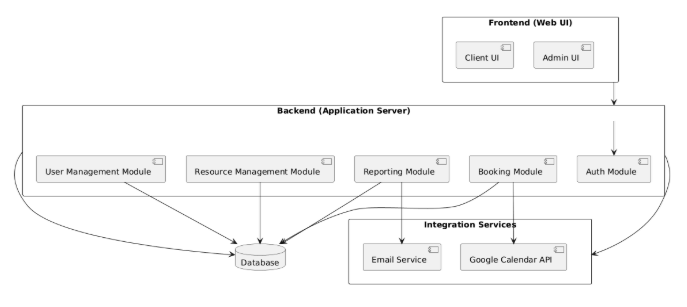
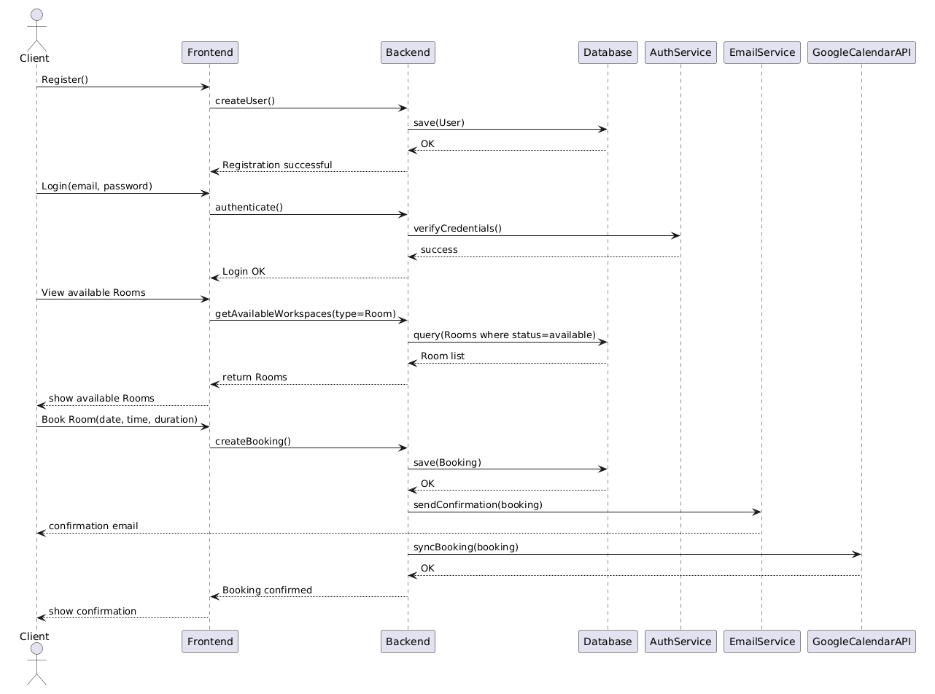
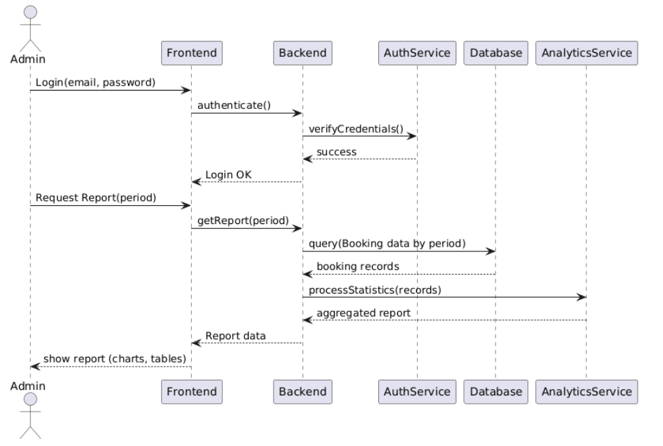

## **1\. Вступ**

### **1.1 Мета**

Цей документ описує функціональні та нефункціональні вимоги для веб\-додатку “Система управління коворкінгом**”**, який дозволяє ефективно керувати простором, бронюванням робочих місць та послугами для клієнтів.

### **1.2 Область застосування**

Система призначена для адміністраторів коворкінгів, співробітників та клієнтів. Вона дозволяє бронювати робочі місця, керувати доступом, переглядати доступні послуги, а також відстежувати зайнятість та статистику.

## **2\. Загальний опис**

### **2.1 Перспектива продукту**

Система буде веб\-додатком із зручним інтерфейсом та інтеграцією з календарями (Google Calendar, Outlook) для синхронізації бронювань. Система повинна підтримувати адміністрування приміщень, робочих місць та користувачів.

### **2.2 Функції продукту**

- Реєстрація та аутентифікація користувачів (адміністраторів і клієнтів).
- Бронювання робочих місць та кімнат для зустрічей.
- Перегляд доступних місць у реальному часі.
- Управління послугами та ресурсами (Wi-Fi, принтери, кавові машини).
- Генерація звітів щодо зайнятості та використання ресурсів.

### **2.3 Характеристики користувачів**

- **Адміністратори**: керують доступом, бронюванням, статистикою та ресурсами.
- **Клієнти**: бронюють робочі місця та кімнати, переглядають доступні послуги.

### **2.4 Обмеження**

- Потрібне підключення до інтернету для синхронізації даних.
- Сумісність із основними браузерами: Chrome, Firefox, Safari, Opera.
- Обмежена кількість одночасних бронювань залежно від наявних робочих місць.

## **3 Функціональні вимоги**

### **3.1 Бронювання робочих місць та кімнат**

**Вимога:** Користувачі повинні мати можливість бронювати доступні робочі місця та кімнати для зустрічей.  
**Критерії прийняття:**

- Веб-додаток показує доступні місця та кімнати у реальному часі.
- Користувач може обирати дату, час та тривалість бронювання.
- Після підтвердження бронювання система надсилає підтвердження на електронну пошту.
- Заброньовані місця блокуються для інших користувачів.

### **3.2 Перегляд зайнятості та послуг**

**Вимога:** Користувачі повинні бачити, які місця та кімнати зайняті або вільні.  
**Критерії прийняття:**

- Інтерактивна карта коворкінгу відображає зайнятість робочих місць.
- Система повідомляє про наявність або відсутність необхідних послуг (Wi-Fi, принтери, кавові машини).

### **3.3 Управління користувачами та ресурсами**

**Вимога:** Адміністратори можуть керувати обліковими записами користувачів.  
**Критерії прийняття:**

- Адміністратор може відстежувати використання ресурсів у реальному часі.
- Адміністратор може створювати, редагувати та видаляти облікові записи.
- Користувачі отримують права доступу відповідно до ролі (клієнт/адміністратор).

**3.4 Генерація звітів**

**Вимога:** Адміністратори повинні мати можливість отримувати статистику.  
**Критерії прийняття:**

- Система логує зайнятість робочих місць, популярність кімнат та використання послуг.
- Можливість експортувати звіти у форматі PDF або Excel.
- Система оновлює звіти в реальному часі.

## **4\. Нефункціональні вимоги**

### **4.1 Зручність**

**Вимога:** Інтерфейс повинен бути інтуїтивно зрозумілим та легким у використанні.  
**Критерії прийняття:**

- Інтерфейс простий у навігації.
- Час відгуку системи не перевищує 2 секунди для будь-якої операції.

### **4.2 Безпека**

**Вимога:** Система повинна захищати дані користувачів.  
**Критерії прийняття:**

- Дані користувачів зберігаються у зашифрованому вигляді.
- Аутентифікація через надійний пароль або OAuth.
- Дані не передаються без згоди користувача.

### **4.3 Доступність**

**Вимога:** Система повинна бути доступною у будь-який час.  
**Критерії прийняття:**

- Доступність сервісу ≥ 99%.
- Система повинна підтримувати різні браузери (Chrome, Firefox, Safari, Opera).
- Адаптивність для мобільних пристроїв.

### **4.4 Масштабованість**

**Вимога:** Система повинна підтримувати зростання навантаження.  
**Критерії прийняття:**

- Можливість додавати нові приміщення та робочі місця без перебудови архітектури.
- Підтримка одночасної роботи великої кількості користувачів.

###

## **5\. Архітектура системи**

Система “Система управління коворкінгом” реалізована за принципом клієнт-серверної архітектури з трьома основними компонентами:

1. **Frontend (веб-клієнт)**

   - Реалізовано на React \+ TypeScript.

   - Використовується адаптивний дизайн для мобільних пристроїв.

   - Взаємодіє з backend через REST API.

2. **Backend (сервер додатків)**

   - Реалізовано на Node.js з NestJS або Express.

   - Відповідає за логіку бронювання, управління користувачами, ресурсами та генерацію звітів.

   - Здійснює аутентифікацію та авторизацію користувачів через JWT або OAuth2.

3. **Database (СУБД)**

   - PostgreSQL або MySQL для зберігання даних про користувачів, бронювання, кімнати, ресурси та статистику.

   - Використовується ORM (Prisma або TypeORM) для доступу до бази даних.

4. **Integration Services (Сервіси інтеграцій)**

   - Google Calendar API та Outlook API для синхронізації бронювань.

   - Email Service для надсилання підтверджень бронювань.

## **6\. Технологічний стек**

- **Frontend**: React, TypeScript, Tailwind CSS, Redux/Context API.

- **Backend**: Node.js, NestJS/Express, REST API.

- **Database**: PostgreSQL/MySQL, ORM (Prisma/TypeORM).

- **Аутентифікація**: JWT, OAuth2 (Google Sign-In).

- **DevOps / CI-CD**: Docker, GitHub Actions для тестів і деплою.

- **Тестування**: Jest (unit), Cypress (E2E).

## **7\. Архітектурні діаграми**

- **Use Case Diagram**: відображає сценарії взаємодії користувачів з системою.

- **Component Diagram**: показує взаємодію frontend, backend, database та інтеграційних сервісів.

- **Class Diagram**: моделі основних сутностей (User, Workspace, Room, Booking, Resource, Report).

- **Sequence Diagrams**: основні сценарії: бронювання кімнати, генерація звіту адміністратором.

## **8\. Інтерфейси**

- **Користувацький інтерфейс (UI)**: веб\-клієнт, доступний з браузера та мобільних пристроїв.

- **API інтерфейс**: REST API для CRUD-операцій (користувачі, бронювання, ресурси, звіти).

- **Інтеграції**: Google Calendar API, Outlook API, Email Service.  
  
  

## **9\. Технічні обмеження**

- Мінімальні версії: Node.js 18+, PostgreSQL 15+.

- Використання HTTPS для всіх запитів.

- Обмеження на максимальну кількість одночасних сесій користувача.

- Сумісність із браузерами: Chrome, Firefox, Safari, Opera.

###
