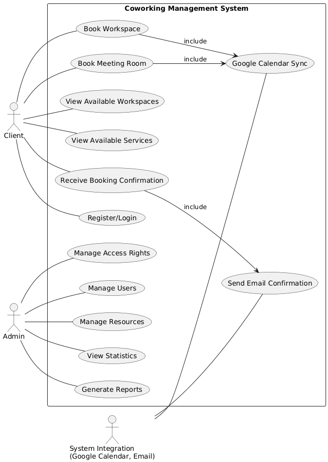
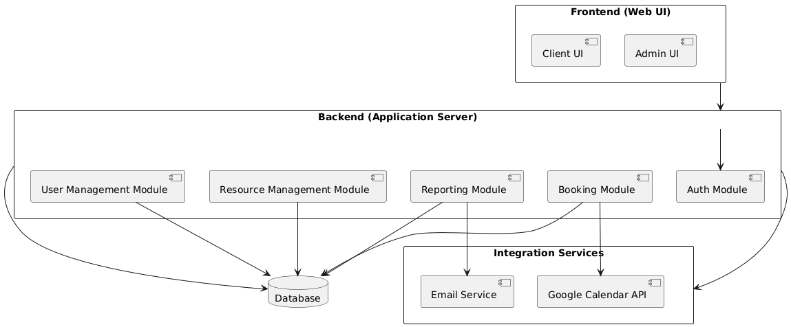
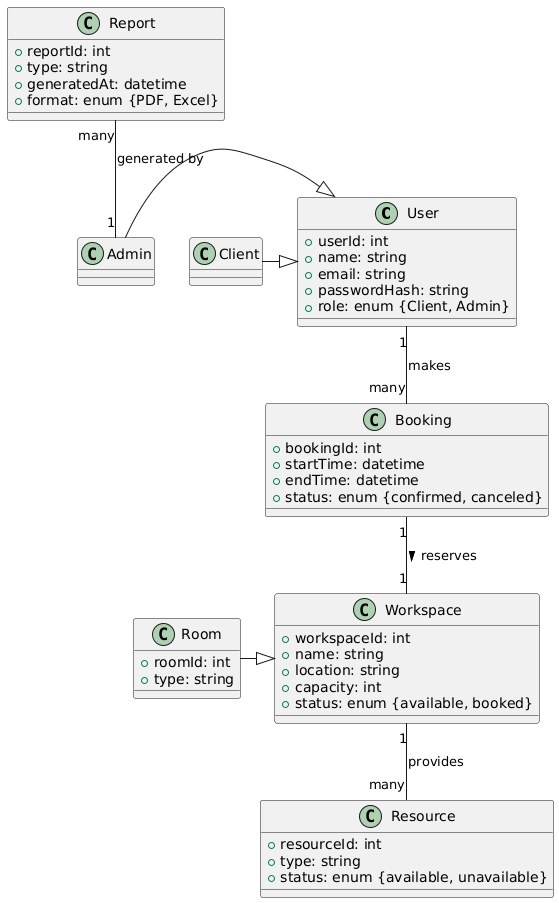
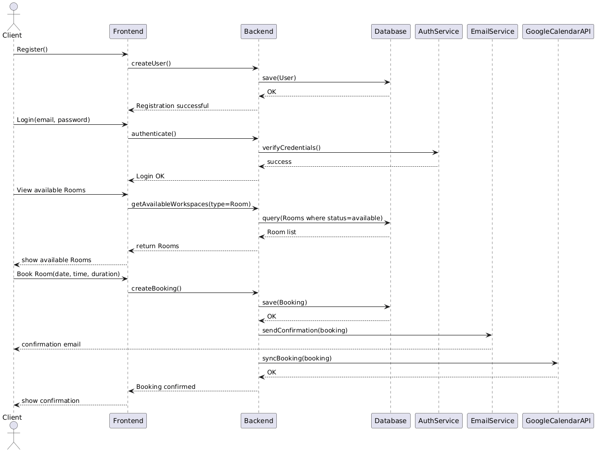

## **1\. Introduction**

### **1.1 Purpose**

This document describes the functional and non-functional requirements for the web application “Coworking Management System”, which enables efficient management of space, workplace bookings, and services for clients.

### **1.2 Scope**

The system is intended for coworking administrators, staff, and clients. It allows booking workspaces, managing access, viewing available services, and monitoring occupancy and statistics.

## **2\. General Description**

### **2.1 Product Perspective**

The system will be a web application with a user-friendly interface and integration with calendars (Google Calendar, Outlook) for booking synchronization. The system must support administration of premises, workplaces, and users.

### **2.2 Product Functions**

* User registration and authentication (administrators and clients).  
* Booking of workplaces and meeting rooms.  
* Viewing available spaces in real time.  
* Management of services and resources (Wi-Fi, printers, coffee machines).  
* Generation of reports on occupancy and resource usage.

### **2.3 User Characteristics**

* **Administrators**: manage access, bookings, statistics, and resources.  
* **Clients**: book workspaces and rooms, view available services.

### **2.4 Constraints**

* Internet connection is required for data synchronization.  
* Compatibility with major browsers: Chrome, Firefox, Safari, Opera.  
* Limited number of simultaneous bookings depending on available workspaces.

## **3 Functional Requirements**

### **3.1 Booking Workplaces and Rooms**

**Requirement:** Users must be able to book available workplaces and meeting rooms.  
**Acceptance Criteria:**

* The web application displays available workplaces and rooms in real time.  
* The user can select the date, time, and duration of the booking.  
* After confirming a booking, the system sends a confirmation to the user’s email.  
* Reserved workplaces are blocked for other users.

### **3.2 Viewing Occupancy and Services**

**Requirement:** Users must be able to see which workplaces and rooms are occupied or available.  
**Acceptance Criteria:**

* An interactive coworking map displays workplace occupancy.  
* The system informs about the availability or unavailability of required services (Wi-Fi, printers, coffee machines).

### **3.3 User and Resource Management**

**Requirement:** Administrators can manage user accounts.  
**Acceptance Criteria:**

* The administrator can monitor resource usage in real time.  
* The administrator can create, edit, and delete user accounts.  
* Users receive access rights according to their role (client/administrator).

**3.4 Report Generation**

**Requirement:** Administrators must be able to obtain statistics.  
**Acceptance Criteria:**

* The system logs workplace occupancy, room popularity, and service usage.  
* Reports can be exported in PDF or Excel format.  
* The system updates reports in real time.

## **4\. Non-Functional Requirements**

### **4.1 Usability**

**Requirement:** The interface must be intuitive and easy to use.  
**Acceptance Criteria:**

* The interface is simple to navigate.  
* The system response time does not exceed 2 seconds for any operation.

### **4.2 Security**

**Requirement:** The system must protect user data.  
**Acceptance Criteria:**

* User data is stored in encrypted form.  
* Authentication via secure password or OAuth.  
* Data is not transmitted without user consent.

### **4.3 Availability**

**Requirement:** The system must be available at all times.  
**Acceptance Criteria:**

* Service availability ≥ 99%.  
* The system must support major browsers (Chrome, Firefox, Safari, Opera).  
* Adaptive design for mobile devices.

### **4.4 Scalability**

**Requirement:** The system must support increasing loads.  
**Acceptance Criteria:**

* Ability to add new premises and workplaces without re-architecting the system.  
* Support for simultaneous operation by a large number of users.

### 

## **5\. System Architecture**

The “Coworking Management System” is implemented using a client-server architecture with three main components:

**Frontend (web client):**

* Implemented with React \+ TypeScript.  
* Uses responsive design for mobile devices.  
* Interacts with the backend via REST API.

**Backend (application server):**

* Implemented with Node.js using NestJS or Express.  
* Responsible for booking logic, user and resource management, and report generation.  
* Handles user authentication and authorization via JWT or OAuth2.

**Database (DBMS):**

* PostgreSQL or MySQL is used to store data about users, bookings, rooms, resources, and statistics.  
* ORM (Prisma or TypeORM) is used for database access.

**Integration Services:**

* Google Calendar API and Outlook API for booking synchronization.  
* Email Service for sending booking confirmations.

## **6\. Technology Stack**

* **Frontend**: React, TypeScript, Tailwind CSS, Redux/Context API.

* **Backend**: Node.js, NestJS/Express, REST API.

* **Database**: PostgreSQL/MySQL, ORM (Prisma/TypeORM).

* **Authentication**: JWT, OAuth2 (Google Sign-In).

* **DevOps / CI-CD**: Docker, GitHub Actions for testing and deployment.

* **Testing**: Jest (unit), Cypress (E2E).

## **7. Architectural Diagrams**

* **Use Case Diagram**: illustrates user interaction scenarios with the system.

* **Component Diagram**: shows the interaction between the frontend, backend, database, and integration services.

* **Class Diagram**: models the main entities (User, Workspace, Room, Booking, Resource, Report).

* **Sequence Diagrams**: key scenarios such as room booking and report generation by the administrator.

## **8\. Interfaces**

* **User Interface (UI)**: web client accessible via browser and mobile devices.  
* **API Interface**: REST API for CRUD operations (users, bookings, resources, reports).  
* **Integrations**: Google Calendar API, Outlook API, Email Service.  
  
  

## **9\. Technical Constraints**

* Minimum versions: Node.js 18+, PostgreSQL 15+.  
* Use of HTTPS for all requests.  
* Limitations on the maximum number of concurrent user sessions.  
* Browser compatibility: Chrome, Firefox, Safari, Opera.